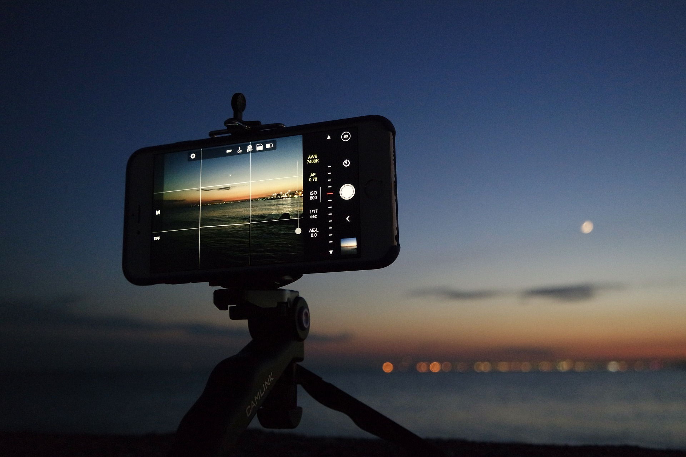

<h1 class="kva-blog-title">Keva Android App Now Supports IPFS Images!</h1>

{{ date | date: '%B %d %Y' }}

## Kevacoin Meets IPFS

We are pleased to release the latest version of the Keva Android app that supports image displaying through IPFS! The Keva app is now a step closer to be a fully functional, fully decentralized microblogging platform. Download today from the <a href="https://play.google.com/store/apps/details?id=org.kevacoin.kevawallet">Google Play Store</a>, or <a href="https://github.com/kevacoin-project/keva_wallet/releases/tag/v6.7.0">here</a> and give it a try!

Because it is a fully decentralized microblogging platform, it does not require centralized databases and servers. Everyone can run and connect to their own server, while the content is available and the same everywhere. The app by default connects to the servers maintained by the Kevacoin project, but it is easy to switch to your own server. The server is the popular ElectrumX server, with additional support for Kevacoin. Refer to this <a href="./keva_electrumx.html">article</a> on how to install the ElectrumX server.

To host/pinning images on IPFS, you need an additional Keva IPFS proxy server, which should be intalled on the same server as ElectrumX server. The source code of the proxy server and the installation guide can be found <a href="https://github.com/kevacoin-project/keva_ipfs">here</a>. It is up to you to decide how much to charge for pinning an image on IPFS by simply setting an environment variable (the official Kevacoin server charges 5 KVA).

If you need some Kevacoins to publish your blog (only a tiny amount is needed), feel free to send us a Twitter direct message <a href="https://twitter.com/kevacoin">@kevacoin</a>, and we will be glad to share some Kevacoins with you.

---
Image by <a href="https://pixabay.com/users/pexels-2286921/?utm_source=link-attribution&amp;utm_medium=referral&amp;utm_campaign=image&amp;utm_content=1840180">Pexels</a> from <a href="https://pixabay.com/?utm_source=link-attribution&amp;utm_medium=referral&amp;utm_campaign=image&amp;utm_content=1840180">Pixabay</a>